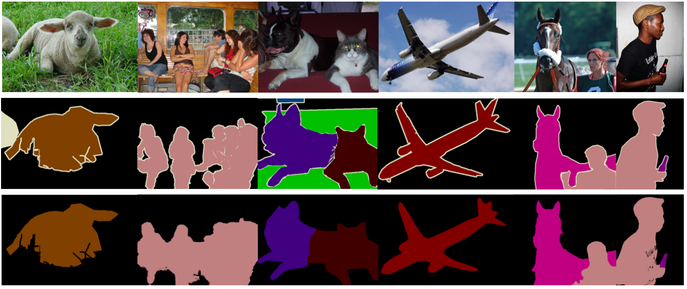

# Puzzle-CAM
The official implementation of "Puzzle-CAM: Improved localization via matching partial and full features".

## Citation
Please cite our paper if the code is helpful to your research.
```
```

## Abstract
Weakly-supervised semantic segmentation (WSSS) is introduced to narrow the gap for semantic segmentation performance from pixel-level supervision to image-level supervision.
Most advanced approaches are based on class activation maps (CAMs) to generate pseudo-labels to train the segmentation network.
The main limitation of WSSS is that the process of generating pseudo-labels from CAMs which use an image classifier is mainly focused on the most discriminative parts of the objects.
To address this issue, we propose Puzzle-CAM, a process minimizes the differences between the features from separate patches and the whole image.
Our method consists of a puzzle module (PM) and two regularization terms to discover the most integrated region of in an object.
Without requiring extra parameters, Puzzle-CAM can activate the overall region of an object using image-level supervision.
In experiments, Puzzle-CAM outperformed previous state-of-the-art methods using the same labels for supervision on the PASCAL VOC 2012 test dataset.

## Overview


<br>

# Prerequisite
- Python 3.8, PyTorch 1.7.0, and more in requirements.txt
- CUDA 10.1, cuDNN 7.6.5
- 4 x Titan RTX GPUs

# Usage

## Install python dependencies
```bash
python3 -m pip install -r requirements.txt
```

## Download PASCAL VOC 2012 devkit
Follow instructions in http://host.robots.ox.ac.uk/pascal/VOC/voc2012/#devkit

## 1. Train an image classifier for generating CAMs
```bash
CUDA_VISIBLE_DEVICES=0,1,2,3 python3 train_classification_with_puzzle.py --architecture resnest101 --re_loss_option masking --re_loss L1_Loss --alpha_schedule 0.50 --alpha 4.00 --tag ResNeSt101@Puzzle@optimal --data_dir $your_dir
```

## 2. Apply Random Walk (RW) to refine the generated CAMs
2.1. Make affinity labels to train AffinityNet.
```bash
CUDA_VISIBLE_DEVICES=0 python3 inference_classification.py --architecture resnest101 --tag ResNeSt101@Puzzle@optimal --domain train_aug --data_dir $your_dir
python3 make_affinity_labels.py --experiment_name ResNeSt101@Puzzle@optimal@train@scale=0.5,1.0,1.5,2.0 --domain train_aug --fg_threshold 0.40 --bg_threshold 0.10 --data_dir $your_dir
```

2.2. Train AffinityNet.
```bash
CUDA_VISIBLE_DEVICES=0 python3 train_affinitynet.py --architecture resnest101 --tag AffinityNet@ResNeSt-101@Puzzle --label_name ResNeSt101@Puzzle@optimal@train@scale=0.5,1.0,1.5,2.0@aff_fg=0.40_bg=0.10 --data_dir $your_dir
```

## 3. Train the segmentation model using the pseudo-labels
3.1. Make segmentation labels to train segmentation model.
```bash
CUDA_VISIBLE_DEVICES=0 python3 inference_rw.py --architecture resnest101 --model_name AffinityNet@ResNeSt-101@Puzzle --cam_dir ResNeSt101@Puzzle@optimal@train@scale=0.5,1.0,1.5,2.0 --domain train_aug --data_dir $your_dir
python3 make_pseudo_labels.py --experiment_name AffinityNet@ResNeSt-101@Puzzle@train@beta=10@exp_times=8@rw --domain train_aug --threshold 0.35 --crf_iteration 1 --data_dir $your_dir
```

3.2. Train segmentation model.
```bash
CUDA_VISIBLE_DEVICES=0,1,2,3 python3 train_segmentation.py --backbone resnest101 --mode fix --use_gn True --tag DeepLabv3+@ResNeSt-101@Fix@GN --label_name AffinityNet@ResNeSt-101@Puzzle@train@beta=10@exp_times=8@rw@crf=1 --data_dir $your_dir
```

## 4. Evalute the models
```bash
CUDA_VISIBLE_DEVICES=0 python3 inference_segmentation.py --backbone resnest101 --mode fix --use_gn True --tag DeepLabv3+@ResNeSt-101@Fix@GN --scale 0.5,1.0,1.5,2.0 --iteration 10

python3 evaluate.py --experiment_name DeepLabv3+@ResNeSt-101@Fix@GN@val@scale=0.5,1.0,1.5,2.0@iteration=10 --domain val --data_dir $your_dir/SegmentationClass
```

## 5. Results
Qualitative segmentation results on the PASCAL VOC 2012 validation set. 
Top: original images. Middle: ground truth. Bottom: prediction of the segmentation model trained using the pseudo-labels from Puzzle-CAM.


<br>

For any issues, please contact <b>Sanghyun Jo</b>, josanghyeokn@gmail.com